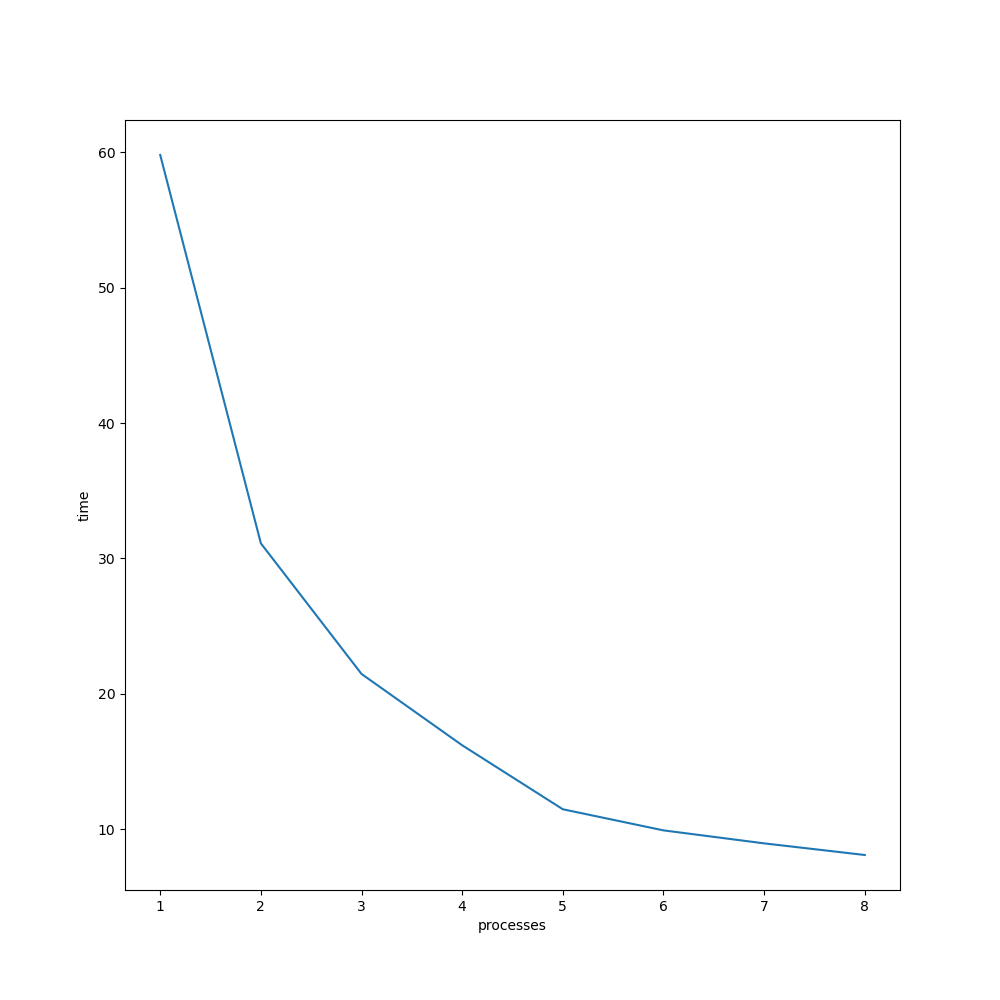
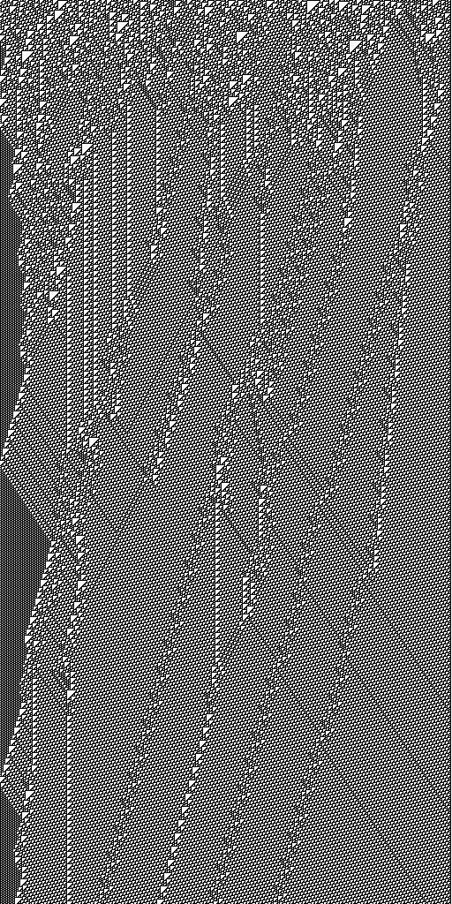

Сделал всё по условию (без бонусов).

Время работы:

```c++
  int SPACE_SIZE = 1024 * 128;
  int STEPS = 1024 * 512;
  bool IS_PERIODIC = true;
  int RULE = 110;
  bool PRINT_OUTPUT = false;
```



Результаты работы:

```c++
  int SPACE_SIZE = 512;
  int STEPS = 1024;
  bool IS_PERIODIC = false;
  int RULE = 110;
  bool PRINT_OUTPUT = true;
```


